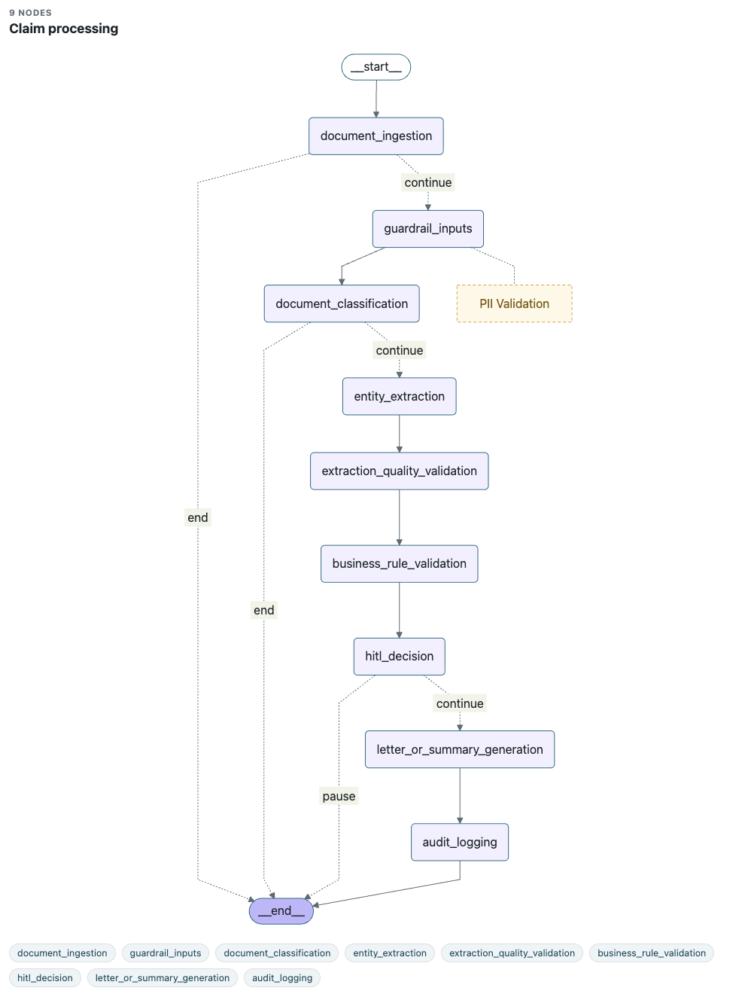
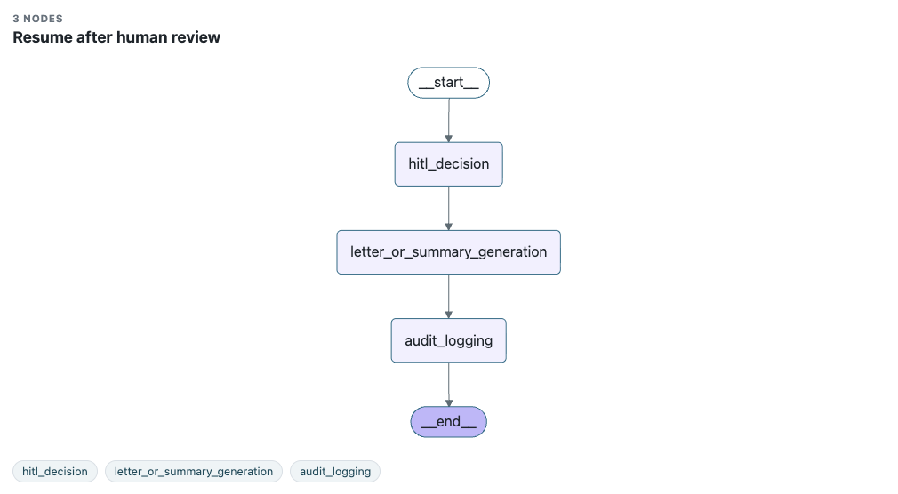

# Autonomous Enterprise Workflow Agent

A production-style POC that reviews **insurance / healthcare claims** end-to-end using an agentic LangGraph pipeline, and pauses for a human caseworker only when policy demands it.

A claim document (PDF or plain text) goes in. The system classifies it, extracts structured entities, runs layered validation, then either auto-decides or parks the claim for review — resuming from exactly where it left off once the caseworker responds.

**Key principle:** everything that varies by customer — which entities to extract, business rules, review thresholds, LLM provider — is **configuration (YAML), not code**. Adding a new tenant is a single file, not a deploy.

---

## Table of Contents

- [Architecture overview](#architecture-overview)
- [Workflow graph](#workflow-graph)
- [Validation layers](#validation-layers)
- [Human-in-the-loop (HITL)](#human-in-the-loop-hitl)
- [Real-time streaming](#real-time-streaming)
- [LLM providers](#llm-providers)
- [Tenant configuration](#tenant-configuration)
- [Getting started](#getting-started)
- [API reference](#api-reference)
- [Sample claims](#sample-claims)
- [Observability](#observability)
- [Project layout](#project-layout)

---

## Architecture overview

```
┌─────────────────────────────────────────────────────────┐
│                        UI (static)                       │
│  Intake tab · History tab · Review tab · SSE progress   │
└───────────────────────┬─────────────────────────────────┘
                        │ HTTP / SSE
┌───────────────────────▼─────────────────────────────────┐
│                   FastAPI backend                        │
│                                                          │
│   routes.py ──► orchestrator.py ──► LangGraph graph     │
│                      │                    │              │
│               event_bus.py          node by node        │
│               (SSE pub/sub)         (streaming)          │
│                                          │               │
│              TenantConfigRepository  LLMClient           │
│              (YAML-driven config)    (det/openai/anth)   │
│                                          │               │
│              JsonWorkflowStateStore  RuleEngine          │
│              (data/workflows/*.json) (YAML rules)        │
└─────────────────────────────────────────────────────────┘
```

**Stack:** Python 3.11 · FastAPI · LangGraph · Pydantic v2 · PyYAML · python-dotenv · OpenAI / Anthropic SDKs (optional) · OpenTelemetry + Prometheus (optional)

---

## Workflow graph

The pipeline is a LangGraph `StateGraph`. A shared `WorkflowState` object flows through every node; conditional edges handle early exits and the HITL pause.

### Claim processing graph



```
START
  → document_ingestion            checks provider is enabled
  → guardrail_inputs              redacts contact PII before any LLM call
  → document_classification       LLM: is this a valid claim?
  → entity_extraction             LLM: extract structured entities
  → extraction_quality_validation checks confidence, mandatory fields, conflicts
  → business_rule_validation      tenant rules (format, coverage limit, …)
  → hitl_decision                 should a human decide?
  → letter_or_summary_generation  LLM: draft letter or exception summary
  → audit_logging                 final consistency check + audit trail
  → END

Early exits:
  document_ingestion  ──► END  (provider disabled → UNSUPPORTED_PROVIDER)
  document_classification ──► END  (not a claim → INVALID_DOCUMENT)
  hitl_decision       ──► END  (needs review → WAITING_FOR_HUMAN_REVIEW)
```

### Resume graph (after human review)



When a caseworker submits a decision, a second smaller graph picks up from after the pause:

```
START → hitl_decision → letter_or_summary_generation → audit_logging → END
```

Nothing before the pause re-runs. The saved `WorkflowState` is loaded from disk and the resume graph runs to completion.

---

## Validation layers

Validation is **layered and non-throwing** — every layer appends `ValidationFinding` objects to the workflow state rather than raising. A claim always reaches a terminal decision, and the full finding trail is available in the API response and the UI.

A finding blocks the claim only when `outcome=FAILED` **and** `severity=ERROR|BLOCKER`. `WARNING` and `INFO` findings are recorded for the caseworker but never stop the flow on their own.

| Layer | Node | What it checks | Blocking severity | Effect when blocked |
|---|---|---|---|---|
| **GUARDRAIL** | `guardrail_inputs` | Scrubs contact PII (email, phone) before any LLM call | Never blocks | Protective only — records redaction counts |
| **DOCUMENT** | `document_classification` | Is this a supported claim? Counts configured `document_signals`; passes when count ≥ minimum | `BLOCKER` | `INVALID_DOCUMENT` — pipeline ends early |
| **EXTRACTION** | `extraction_quality_validation` | Mandatory entities present, confidence ≥ threshold, no conflicting values | `BLOCKER` (missing mandatory), `ERROR` (conflict), `WARNING` (low confidence) | Routes to human review (if enabled), else `REJECTED` |
| **BUSINESS** | `business_rule_validation` | Tenant rules: policy number format, coverage limits, etc. | `ERROR` | `REJECTED` — unless a HITL rule also fired |
| **HITL** | `hitl_decision` | Tenant review rules: high-value claims, extraction issues | `WARNING` | `WAITING_FOR_HUMAN_REVIEW` |
| **FINAL_DECISION** | `audit_logging` | Consistency guard: `APPROVED` must have no blocking failures | `BLOCKER` | Safety net — catches inconsistent terminal state |

**Routing summary (decided in `hitl_decision`):**

- Provider disabled → `UNSUPPORTED_PROVIDER`
- Not a claim → `INVALID_DOCUMENT`
- Extraction blocker/error → human review (if enabled), else `REJECTED`
- Business rule failure → `REJECTED` (unless HITL also triggered)
- HITL rule triggered → `WAITING_FOR_HUMAN_REVIEW`
- Nothing blocking → `APPROVED`

---

## Human-in-the-loop (HITL)

A pause is **persisted state, not a blocked thread**. When `hitl_decision` routes to review:

1. The claim is saved to disk as `WAITING_FOR_HUMAN_REVIEW` with a `ReviewTask` attached.
2. The API request returns immediately — no thread is held.
3. A caseworker sees the claim in the **Review** tab and submits a decision.
4. `POST /workflows/{id}/review` loads the saved state and runs the resume graph.

Supported actions: `approve` · `reject` · `request_more_info`

State persists across server restarts — paused claims are never lost.

---

## Real-time streaming

Claim processing is asynchronous. After upload the UI receives a `workflow_id` instantly and opens a Server-Sent Events (SSE) connection to watch the pipeline run node by node.

```
POST /claims/submit        ← returns {workflow_id, status: RECEIVED} immediately
GET  /claims/{id}/stream   ← SSE stream, one event per completed node

event: node_complete
data: {"node": "entity_extraction", "status": "PROCESSING", "audit_events": [...]}

event: complete
data: {"workflow_id": "WF-...", "status": "APPROVED"}
```

The pipeline stepper in the UI updates live as each event arrives. The same streaming pattern applies to human review resume (`POST /workflows/{id}/review/stream`).

The sync endpoints (`/claims/upload`, `/claims/process`) remain for direct API use and tests — they block until the pipeline finishes and return the final state.

---

## LLM providers

Three implementations of the `LLMClient` interface, selected per tenant via YAML:

| Provider | Config `provider` | Requires | Use case |
|---|---|---|---|
| **Deterministic** | `deterministic` | Nothing | Local demo, offline, tests — regex-based extraction |
| **OpenAI** | `openai` | `OPENAI_API_KEY` | GPT-4.1-mini or any OpenAI model |
| **Anthropic** | `anthropic` | `ANTHROPIC_API_KEY` | Claude models |

All providers receive **identical structured prompts** from [`app/llm/prompts/`](BE/app/llm/prompts/). The entity extraction prompt includes the exact JSON schema (with per-entity key types and examples) so the model follows the output contract strictly.

A Pydantic `model_validator` in [`app/llm/schemas.py`](BE/app/llm/schemas.py) normalises common LLM response deviations (numeric entity values, scalar confidence, null conflicts) as a safety net.

---

## Tenant configuration

Configuration lives in [`BE/config/`](BE/config/):

```
BE/config/
  document_types.yaml      # Shared document signal catalogue
  entity_schema.yaml       # Default entity definitions (name, patterns, threshold)
  hitl_policy.yaml         # Default HITL policy settings
  letter_templates.yaml    # Letter/summary templates
  tenants/
    default.yaml           # tenant_id: de  (deterministic, generic rules)
    care_health.yaml       # tenant_id: ch  (OpenAI, CAR-###### format, 75k limit)
    max_bupa.yaml          # tenant_id: mb  (OpenAI, MAX-###### format, 100k limit)
```

Each tenant file is **self-contained**: identity, feature flags, LLM settings, business rules, and HITL rules. The base YAML files provide defaults that a tenant can override.

### Tenant reference

| `tenant_id` | Tenant | LLM | Policy format | Coverage limit | HITL threshold |
|---|---|---|---|---|---|
| `de` | Default | deterministic | `ABC-123456` | $50,000 | >$10,000 |
| `ch` | Care Health | openai/gpt-4.1-mini | `CAR-123456` | $75,000 | >$15,000 |
| `mb` | Max Bupa | openai/gpt-4.1-mini | `MAX-123456` | $100,000 | >$20,000 |

### Adding a tenant

Create `BE/config/tenants/acme.yaml`:

```yaml
tenant_id: ac
provider_id: acme
display_name: Acme Insurance
enabled: true

features:
  pdf_ingestion: true
  auto_processing: true
  auto_approval: true
  hitl_review: true
  rejection_letter_generation: true

llm:
  provider: openai
  model: gpt-4.1-mini
  temperature: 0
  max_tokens: 1200

business_rules:
  - id: POLICY_NUMBER_FORMAT
    type: regex_match
    severity: ERROR
    enabled: true
    parameters:
      entity: policy_number
      pattern: "ACM-\\d{6}"

hitl_rules:
  - id: HIGH_VALUE_REVIEW
    type: decimal_gt
    severity: WARNING
    enabled: true
    parameters:
      entity: claim_amount
      threshold: 25000
```

No code change. The new tenant appears in `GET /providers` on the next server start.

---

## Getting started

### Prerequisites

- Python 3.11+
- `OPENAI_API_KEY` or `ANTHROPIC_API_KEY` in `BE/.env` (only if using those providers; the `deterministic` provider needs neither)

### Quick start

```bash
  cp BE/.env.example BE/.env   # fill in API keys if needed
./start.sh
```

`start.sh` creates `BE/.venv`, installs all dependencies, frees the configured ports, and starts both servers. Stop with `Ctrl+C`.

| URL | What opens |
|---|---|
| `http://127.0.0.1:5173` | Claim intake UI |
| `http://127.0.0.1:8000/docs` | Interactive API docs (Swagger) |
| `http://127.0.0.1:8000/health` | Health check |

Ports are configurable: `BE_PORT=8100 FE_PORT=5180 ./start.sh`

### Running BE and UI separately

```bash
  # Backend
    cd BE
    python -m venv .venv && source .venv/bin/activate
    pip install -e ".[dev,pdf,observability]"
    python -m uvicorn app.main:app --reload

  # Frontend (separate terminal)
    python3 -m http.server 5173 --directory UI
```

### Environment variables

Copy `BE/.env.example` to `BE/.env`. Key settings:

| Variable | Default | Description |
|---|---|---|
| `BE_HOST` | `127.0.0.1` | Backend bind address |
| `BE_PORT` | `8000` | Backend port |
| `UI_ORIGINS` | `http://127.0.0.1:5173` | CORS allowed origin(s) |
| `OPENAI_API_KEY` | _(empty)_ | Required for `openai` tenants |
| `ANTHROPIC_API_KEY` | _(empty)_ | Required for `anthropic` tenants |
| `LOG_LEVEL` | `INFO` | Log verbosity |
| `LOG_DIR` | `BE/logs` | Log file location |
| `ENABLE_TRACING` | `false` | OpenTelemetry tracing |
| `ENABLE_METRICS` | `false` | Prometheus metrics at `/metrics` |

---

## API reference

### Endpoints

| Method | Path | Description |
|---|---|---|
| `GET` | `/health` | Liveness check |
| `GET` | `/providers` | List all configured tenants |
| `GET` | `/graph` | LangGraph topology (Mermaid) for the UI |
| `POST` | `/claims/process` | Process a claim from inline text (sync) |
| `POST` | `/claims/upload` | Process a claim from file upload (sync) |
| `POST` | `/claims/submit` | Submit a claim for background processing (async) |
| `GET` | `/claims/{id}/stream` | SSE stream of pipeline node events |
| `GET` | `/workflows` | List workflows (optional `?status=` filter) |
| `GET` | `/workflows/{id}` | Fetch one workflow's full state |
| `POST` | `/workflows/{id}/review` | Submit human decision (sync) |
| `POST` | `/workflows/{id}/review/stream` | Submit human decision, stream resume (async) |
| `GET` | `/metrics` | Prometheus metrics (`ENABLE_METRICS=true` only) |

A claim is sent to a tenant by `tenant_id`. The LLM provider is derived from the tenant's own config — no `provider_id` in the request.

### Examples

**Process a claim from text:**

```bash
  curl -X POST http://127.0.0.1:8000/claims/process \
  -H "Content-Type: application/json" \
  -d '{
    "tenant_id": "de",
    "source_name": "claim.txt",
    "document_text": "Claim Form\nClaimant Name: Rahul Sharma\nPolicy Number: ABC-987654\nClaim Amount: $14500\nReason for Claim: Surgery\nProvider Name: Metro Hospital\nService Date: 2026-07-21"
  }'
```

**Upload a PDF or TXT file:**

```bash
  curl -X POST "http://127.0.0.1:8000/claims/upload?tenant_id=ch" \
  -F "file=@samples/claim_review.pdf"
```

**Submit async (returns immediately, stream separately):**

```bash
  curl -X POST "http://127.0.0.1:8000/claims/submit?tenant_id=mb" \
  -F "file=@samples/claim_approval.txt"

  # Then stream the pipeline progress:
  curl -N http://127.0.0.1:8000/claims/WF-XXXXXXXX/stream
```

**Resume a paused claim:**

```bash
  curl -X POST http://127.0.0.1:8000/workflows/WF-XXXXXXXX/review \
  -H "Content-Type: application/json" \
  -d '{"action": "approve", "reviewer": "caseworker@example.com", "notes": "Verified documents."}'
```

An unknown `tenant_id` returns `404`. A review on a non-paused workflow returns `409`.

---

## Sample claims

The `samples/` directory contains ready-to-upload test files:

| File | Expected outcome |
|---|---|
| `claim_approve.txt` | `APPROVED` (low value, passes all rules) |
| `claim_approval.pdf` | `APPROVED` (PDF version) |
| `claim_review.txt` | `WAITING_FOR_HUMAN_REVIEW` (high value claim) |
| `claim_review.pdf` | `WAITING_FOR_HUMAN_REVIEW` (PDF version) |
| `claim_business_validation_failed.pdf` | `REJECTED` (business rule failure) |
| `not_a_claim.txt` | `INVALID_DOCUMENT` (not a claim) |
| `not_a_claim.pdf` | `INVALID_DOCUMENT` (PDF version) |

---

## Observability

Two feature flags in `BE/.env` enable telemetry (both default `false`):

### Tracing (`ENABLE_TRACING=true`)

OpenTelemetry traces auto-instrument FastAPI requests and add a span per claim. Spans nest naturally:

```
request (POST /claims/process)
  └─ claim.process
       ├─ node.document_ingestion
       ├─ node.guardrail_inputs
       ├─ node.document_classification
       │    └─ llm.classify_document  (provider=openai, model=gpt-4.1-mini)
       ├─ node.entity_extraction
       │    └─ llm.extract_entities
       └─ ...
```

Traces export to `OTEL_EXPORTER_OTLP_ENDPOINT` (OTLP/HTTP) if set, otherwise print to the console. Low-value routes (`/health`, `/providers`, `/graph`, `/metrics`) are excluded.

### Metrics (`ENABLE_METRICS=true`)

Prometheus metrics at `GET /metrics`:

| Metric | Labels | Description |
|---|---|---|
| `http_requests_total` | `method, path, status` | HTTP request count |
| `http_request_duration_seconds` | `method, path` | HTTP latency histogram |
| `claims_processed_total` | `tenant, provider, status` | Claims by terminal status |
| `claim_processing_duration_seconds` | — | End-to-end claim duration |
| `workflow_node_runs_total` | `node` | LangGraph node executions |
| `workflow_node_duration_seconds` | `node` | Per-node execution time |
| `llm_requests_total` | `provider, operation, model` | LLM API calls |
| `llm_request_errors_total` | `provider, operation` | Failed LLM calls |
| `llm_request_duration_seconds` | `provider, operation` | LLM latency |

Both flags are off by default — zero runtime cost when disabled. The extra packages install via `pip install -e ".[observability]"` (handled automatically by `start.sh`).

---

## Project layout

```
.
├── start.sh                      Starts BE + UI together (creates venv, handles ports)
├── samples/                      Ready-to-upload test claim files
├── data/
│   ├── static/
│   │   ├── claim_graph.png       LangGraph main pipeline diagram
│   │   └── resume_graph.png      LangGraph resume graph diagram
│   └── workflows/                Persisted workflow JSON (created at runtime)
│
├── BE/                           FastAPI + LangGraph backend
│   ├── app/
│   │   ├── api/
│   │   │   ├── routes.py         All HTTP endpoints (sync + async SSE)
│   │   │   └── schemas.py        Request/response Pydantic models
│   │   ├── config/
│   │   │   ├── loader.py         YAML config loading + deep-merge
│   │   │   └── tenant_config.py  TenantConfigRepository
│   │   ├── core/
│   │   │   ├── app_factory.py    FastAPI app creation + middleware
│   │   │   ├── container.py      Dependency injection container
│   │   │   ├── logging_config.py Rotating file + console handler setup
│   │   │   └── settings.py       AppSettings (dotenv-backed)
│   │   ├── domain/
│   │   │   └── models.py         WorkflowState, EntityDefinition, ValidationFinding, …
│   │   ├── graph/
│   │   │   ├── builder.py        LangGraph StateGraph (run / stream / resume)
│   │   │   ├── state.py          ClaimGraphState TypedDict
│   │   │   └── nodes/            One file per LangGraph node
│   │   ├── llm/
│   │   │   ├── clients/          deterministic / openai / anthropic clients
│   │   │   ├── factory/          LLMProviderFactory (selects + instruments client)
│   │   │   ├── prompts/          Shared prompt templates (classification, extraction, …)
│   │   │   └── schemas.py        EntityExtractionPayload with normalising validator
│   │   ├── observability/        OTel tracing + Prometheus metrics (flag-gated)
│   │   ├── services/
│   │   │   ├── document_classifier.py
│   │   │   ├── document_loader.py   PDF + TXT ingestion
│   │   │   ├── entity_extractor.py  Regex-based deterministic extractor
│   │   │   ├── input_guardrail.py   PII redaction
│   │   │   ├── letter_generator.py
│   │   │   └── rule_engine.py       GUARDRAIL / EXTRACTION / BUSINESS / HITL / FINAL rules
│   │   ├── storage/
│   │   │   └── state_store.py    JsonWorkflowStateStore (data/workflows/*.json)
│   │   └── workflow/
│   │       ├── event_bus.py      Thread-safe pub/sub for SSE node events
│   │       └── orchestrator.py   ClaimWorkflowOrchestrator (create / process / resume)
│   ├── config/
│   │   ├── document_types.yaml
│   │   ├── entity_schema.yaml
│   │   ├── hitl_policy.yaml
│   │   ├── letter_templates.yaml
│   │   └── tenants/
│   │       ├── default.yaml      tenant_id: de
│   │       ├── care_health.yaml  tenant_id: ch
│   │       └── max_bupa.yaml     tenant_id: mb
│   ├── tests/
│   │   ├── test_workflow.py      End-to-end orchestrator tests
│   │   └── test_input_guardrail.py
│   ├── .env.example
│   └── pyproject.toml
│
└── UI/                           Static frontend (no build step)
    ├── index.html                Tab layout: Intake · History · Review
    ├── app.js                    Claim submit, SSE streaming, pipeline stepper
    ├── styles.css
    ├── config.js                 Generated by start.sh (API_BASE_URL)
    └── graph/                    LangGraph topology visualisation page
```

---

## Design notes

**Config over code.** Provider enablement, entity schemas, document signals, business rules, HITL thresholds, and feature flags are all YAML. New tenant = new file.

**Non-blocking validation.** Every node appends findings rather than throwing. A claim always reaches a terminal state with a full audit trail, even when errors occur mid-pipeline.

**Fail-safe pipeline.** Any unhandled exception in the graph is caught by the orchestrator, marked as `FAILED` with the error type recorded, and persisted — the claim is never orphaned in `PROCESSING`.

**HITL as persisted pause.** `WAITING_FOR_HUMAN_REVIEW` is a durable state written to disk. The server can restart; the claim survives. Resume runs only the post-review nodes — no re-processing.

**SSE streaming.** The `WorkflowEventBus` bridges the synchronous LangGraph graph (runs in a thread pool) with the async SSE endpoint. Each completed node publishes an event; the `EventSource` in the UI updates the pipeline stepper in real time.

**Pluggable persistence.** `WorkflowStateStore` is an interface. `JsonWorkflowStateStore` is the POC implementation. Swap in a database-backed store without touching the orchestrator or graph.
